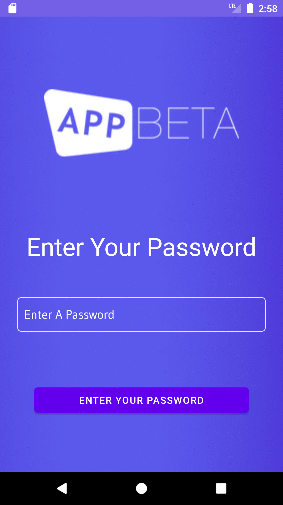

# My Secrets - Diary Application

This is an android Application written in Kotlin language. 
In short, this application allows users to create password protected notes.
Application notes are saved in Android SQLite database.
Since there are not many SQLite sample applications for Kotlin on the internet, I share this application for everyone to access.
Please do not sell my codes over the internet, do not use it in your homework and projects!

## Important Warning ! :

We have the right to take legal action in the event that the application is shared on the internet, distribution, claiming right ownership, selling it for a fee.
These codes are shared only for you to learn the SQLite structure.
Anyone who have access to the codes is agreed to have unconditionally accepted these terms.

All Rights Reserved.

APPBeta Mobile - www.APPBeta.net
## Plagiarism Warning:

If you are in higher education please read "plagiarism.txt" and your University's codes of conduct and other applicable / related documents regarding plagiarism and academic dishonesty.

# Screenshots From Application

